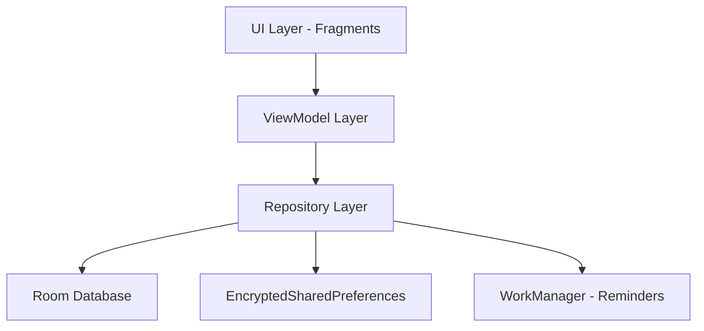

# 📊 RajinKas — Smart Class Finance Management

<p align="center">
  
</p>

<p align="center">
  
  
  
  
</p>

**RajinKas** adalah aplikasi manajemen keuangan kelas berbasis Android yang dirancang untuk menyederhanakan pencatatan iuran, pengelolaan kas, dan pelaporan keuangan secara transparan. Aplikasi ini mengusung pendekatan **Offline-First** dengan arsitektur modern yang menjamin integritas data keuangan kelas Anda.

---

## 🌟 Fitur Unggulan

- **📈 Logika Tunggakan Cerdas (Smart Arrears):** Sistem secara otomatis men-generate tagihan iuran mingguan yang bersifat akumulatif. Jika siswa melewati minggu pembayaran, tunggakan akan terus bertambah hingga dilunasi.
- **📅 Multi-Iuran Aktif:** Bendahara dapat mengaktifkan lebih dari satu jenis iuran secara bersamaan (misal: "Uang Kas Mingguan" dan "Iuran Perpisahan").
- **📋 Penarikan Kas Masal Dinamis:** Antarmuka input masal yang cerdas; secara otomatis menyembunyikan siswa yang sudah membayar pada periode tertentu untuk menghindari duplikasi data.
- **📄 Laporan PDF Profesional:** Ekspor laporan transaksi detail (dengan timestamp menit) dan laporan status tunggakan per siswa yang informatif (✅ Lunas / ❌ Nunggak).
- **🔢 Validasi Absen Ketat:** Sistem mencegah nomor absen ganda atau melompat. Menghapus satu siswa akan memicu *auto-reindex* agar urutan nomor absen tetap rapi.
- **⏰ Integrasi Kalender:** Pengaturan tanggal mulai iuran dan jatuh tempo menggunakan picker kalender `MaterialDatePicker` yang intuitif.
- **🕵️ Audit Log Mendalam:** Mencatat setiap aktivitas krusial (tambah/edit/hapus) beserta detail perubahannya untuk transparansi total.
- **🛡️ Keamanan Berlapis:** Enkripsi sesi menggunakan `MasterKey` dari Jetpack Security dan hashing password menggunakan `BCrypt`.
- **📱 UI Adaptif:** Seluruh formulir input dirancang responsif dan dapat di-scroll untuk kenyamanan penggunaan di berbagai ukuran layar.

---

## 🛠️ Stack Teknologi

| Komponen | Teknologi |
|----------|-----------|
| **SDK Version** | Compile & Target SDK 37 (Android 15+) |
| **Bahasa Utama** |  |
| **User Interface** | Material Design 3 + ViewBinding |
| **Database Lokal** |  |
| **Arsitektur** | MVVM + Repository Pattern |
| **PDF Engine** | iText7 Core |
| **Security** | AndroidX Security Crypto 1.1.0 |

---

## 🏗️ Arsitektur Sistem

RajinKas dibangun dengan standar **Modern Android Development (MAD)**:



- **Single Source of Truth:** Data selalu sinkron antara tampilan dan database melalui `LiveData`.
- **Proactive Generation:** Tunggakan dihitung secara otomatis saat bendahara membuka dashboard.

---

## 🚀 Memulai Pengembangan

1. Clone repositori ini:
   ```bash
   git clone https://github.com/faizabdillahh/RajinKas.git
   ```
2. Buka di **Android Studio Ladybug** atau versi terbaru.
3. Pastikan konfigurasi **JDK 17** pada IDE.
4. Sync Gradle dan jalankan di emulator/perangkat dengan **API 26** ke atas.

---

## 📄 Lisensi

Distribusi di bawah Lisensi MIT. Lihat `LICENSE` untuk informasi lebih lanjut.

---

<p align="center">
  Dibuat dengan ❤️ untuk ekosistem keuangan sekolah yang lebih transparan.
</p>
